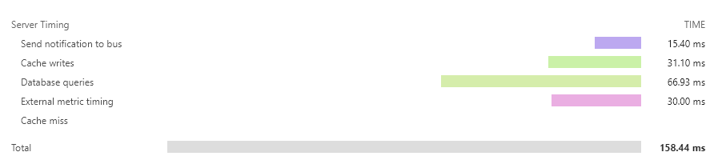

# Timingz

 [](https://github.com/alexmg/Timingz/blob/master/LICENSE)

Timingz is an ASP.NET Core middleware implementation for recording and communicating backend server metrics as outlined in the [Server Timing](https://www.w3.org/TR/server-timing/) specification. These timings can be viewed using the browser's developer tools and accessed using the [PerformanceServerTiming](https://developer.mozilla.org/en-US/docs/Web/API/PerformanceServerTiming) interface.



## Features

- Default configuration gives priority to security and functionality must be explicitly enabled to avoid exposing potentially sensitive information
- Features can be toggled at the individual request level using any information available in the `HttpContext` of the request:
  - Enable/disable writing of the `Server-Timing` header
  - Include metric descriptions in the header or exclude to reduce size
  - Include only the total request duration or add custom metrics for more detail
- Different types of metrics are available to cater for a range of usage scenarios:
  - `Manaul` metrics can be manually started and stopped multiple times
  - `Disposable` metrics can be wrapped in a `using` statement with the duration captured at the end of the statement block
  - `Marker` metrics do not contain a duration but can indicate significant events like a cache miss occuring
  - `Precalculated` metrics can record values captured from an existing timing mechanism
- Metrics can be validated to highlight logic errors that could lead to invalid and misleading timings being recorded
- In addition to being sent in the `Server-Timing` header, metrics captured during the request can also be sent to another service or metrics package after the request has been completed
- The `Timing-Allow-Origin` header can be included with configurable domains
- Durations are measured with the best available platform API using the [Perfolizer (Performance analysis toolkit)](https://github.com/AndreyAkinshin/perfolizer) library
- Header values are written using the [ZString (Zero Allocation StringBuilder)](https://github.com/Cysharp/ZString) library to minimise memory allocations

## Getting started

Install the `Timingz` package from NuGet into your ASP.NET Core web application using your preferred mechanism.

PowerShell Command:

```powershell
Install-Package Timingz
```

.NET Core CLI:

```powershell
dotnet add package Timingz
```

Update `ConfigureServices` in your `Startup` class or host builder to include a call to the `AddServerTiming` extension method on `IServiceCollection`. This will add the required services to the DI container and make the `IServerTiming` service available to your code. You can also register your own `IServerTimingCallback` implementations here with the appropriate service lifetime.

```c#
// This call is mandatory.
services.AddServerTiming();

// This call is only required if you have callback services.
services.AddSingleton<IServerTimingCallback, SampleServerTimingCallback>();
```

Update `Configure` in your `Startup` class or host builder to include a call to the `UseServerTiming` extension method on `IApplicationBuilder`. This will add the middleware to the ASP.NET Core pipeline and should be added before `UseEndpoints` if present. The `UseServerTiming` method accepts a callback for you to configure the options. Some options are global and others are specific to individual requests.

```c#
// Add the middleware before UseEndpoints.
app.UseServerTiming(options =>
{
    // Configure the per-request options.
    options.WithRequestTimingOptions((httpContext, requestOptions) =>
    {
        // The use of a query string parameter is only for demonstration.
        var query = httpContext.Request.Query;

        // Enable/disable the Server-Timing header.
        requestOptions.WriteHeader = query.ContainsKey("timing");

        // Enable/disable the inclusion of descriptions in the header.
        requestOptions.IncludeDescriptions = query.ContainsKey("desc");

        // Enable/disable the inclusion of custom metric values.
        requestOptions.IncludeCustomMetrics = query.ContainsKey("custom");
    });

    // Add any required domains for the Timing-Allow-Origin header.
    options.TimingAllowOrigins = new[] {"http://example.com"};

    // Enable/disable the invocation of callback services.
    options.InvokeCallbackServices = true;

    // Enable/disable the validation of metrics.
    options.ValidateMetrics = env.IsDevelopment();
});
```

## Using the `IServerTiming` service

The `IServerTiming` service is added with a `ServiceLifetime` of `Scoped` resulting in a new instance being created for each HTTP request. This allows the same service instance to be injected into different services used during processing of the HTTP request. The `IServerTiming` service should not be injected into services that that have a `ServiceLifetime` of `Singleton` to avoid a [captive dependency](https://blog.ploeh.dk/2014/06/02/captive-dependency/).

The service is safe to use from multiple threads during a request but a metric for a given name can only be added once. An attempt to create a metric with a duplicate name will result in an exception being thrown.

### Marker

The `Marker` method is used to add a metric that has a name but does not include a duration. These metrics are used like tags that indicate something of importance such as a cache miss occuring.

```c#
serverTiming.Marker("miss", "Cache miss");
```

### Manual

The `Manaul` method returns a metric that can be manually started and stopped multiple times. This allows you to add up the total duration for an activity that is interspersed between other calls.

```c#
var databaseMetric = serverTiming.Manual("db", "Database queries");

databaseMetric.Start();
// The first database query.
databaseMetric.Stop();

// Some other code.

databaseMetric.Start();
// The second database query.
databaseMetric.Stop();
```

### Disposable

The `Disposable` method returns a metric that is already started and will have its duration recorded at the end of a `using` statement block. This is useful when the code being measured occurs with in a single section of code.

```c#
using (serverTiming.Disposable("bus", "Send notification to bus"))
{
    // Send notification to bus.
}
```

### Precalculated

The `Precalculated` method is used to record a metric that has been captured using a separate mechansim such as another metrics package. This allows you to continue using an existing metrics package and have its values included in the `Server-Timing` header.

```c#
var duration = GetTimingFromOtherPackage();
serverTiming.Precalculated("external", duration, "External metric timing");
```

### GetMetrics

This method returns a list of the recorded metrics and can be used for debugging purposes.

> It should be noted that if the total request duration metric is enabled this will not be present until the HTTP response has started.

```c#
var metrics = serverTiming.GetMetrics();
foreach (var metric in metrics)
    await Console.Out.WriteLineAsync(
        $"- Name: {metric.Name}, Description: {metric.Description}, Duration: {metric.Duration}");
```

## Implementing an `IServerTimingCallback` service

A callback service needs to implement the `IServerTimingCallback` interface which has a single `OnServerTiming` method. This method receives a `ServerTimingEvent` instance with properties for the `HttpContext` and a list of `IMetric` instances. The list will contain all recorded `IMetric` instances with their descriptions, including custom metrics, and regardless if descriptions and custom metrics were configured to be included in the `Server-Timing` header. This allows you to capture these metrics in another service or package even if you did not want them send them in the `Server-Timing` header.

```c#
public class SampleServerTimingCallback : IServerTimingCallback, IAsyncDisposable
{
    public async Task OnServerTiming(ServerTimingEvent serverTimingEvent)
    {
        var displayUrl = serverTimingEvent.HttpContext.Request.GetDisplayUrl();
        var metrics = serverTimingEvent.Metrics;
        await Console.Out.WriteLineAsync($"Server-Timing for {displayUrl} has {metrics.Count} metrics");

        foreach (var metric in metrics)
            await Console.Out.WriteLineAsync(
                $"Name: {metric.Name}, Description: {metric.Description}, Duration: {metric.Duration}");
    }

    public async ValueTask DisposeAsync() => await Console.Out.WriteLineAsync("Disposing callback");
}
```

Sample output from the above callback service.

```
Server-Timing for http://localhost:5000/api/sample?timing&desc&custom has 6 metrics:
- Name: external, Description: External metric timing, Duration: 25
- Name: miss, Description: Cache miss, Duration:
- Name: cache, Description: Cache writes, Duration: 39.321600000000004
- Name: db, Description: Database queries, Duration: 61.916700000000006
- Name: total, Description: Total, Duration: 166.9794
- Name: bus, Description: Send notification to bus, Duration: 22.0557
Disposing callback
```

## Credits

Icon made by [Freepik](https://www.flaticon.com/authors/freepik) from [www.flaticon.com](https://www.flaticon.com/)